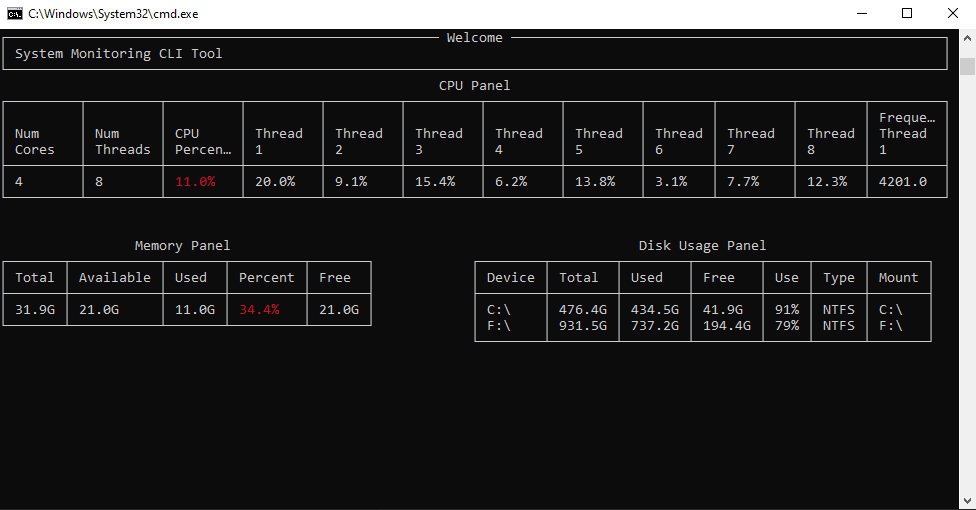

# SysMon

A command-line tool that tracks CPU, memory, and disk usage in real time.
To active the application : 

1. Open the cmd on path SysMon folder.

2. enter this command : python src/main.py --interval 1 --log C:\Users\raz\Desktop\project\SysMon\src --cpu_warn 10 --mem_warn 10 --date 19/03/2026

--interval - an interval for delay in the display ( default - 2 ).
--log - a path to folder that save the logger file in json format.
--cpu_warn - a percentage number for cpu warning ( default - 80 ).
--mem_warn - a percentage number for memory warning ( default - 80 ).
--date - (Optional) a date to display daily report.

Speical Keys : 
Ctrl + C - flush the log and print a clean exit message.

